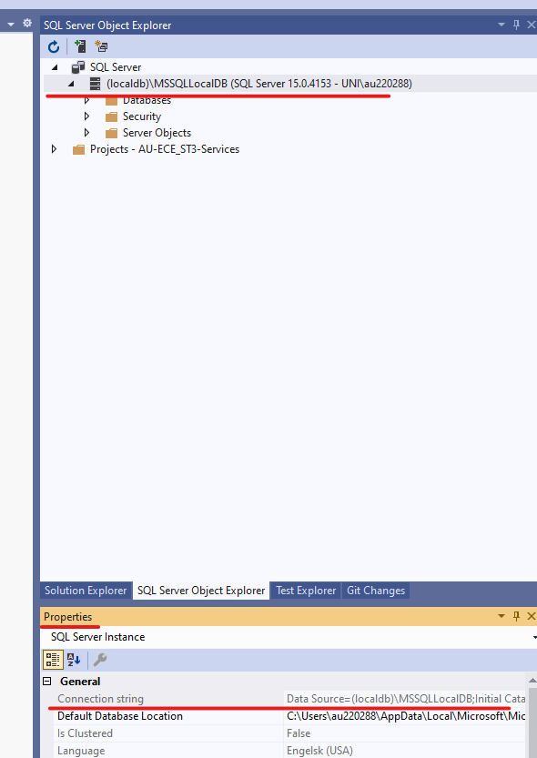
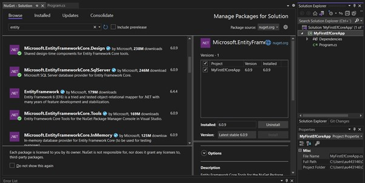
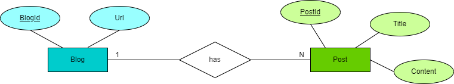

<!-- .slide: data-background="#003d73" -->
## EF Intro and relations

 <!-- .element style="width: 200px; position: fixed; bottom: 50px; left: 50px" -->

----


### Agenda

* Entity Framework Core
* Creating your first project
* Entity Framework core
    * Keys
    * Properties
    * Relationships

---

## Entity Framework (Core)


----

### Object Relation Mapper - Why?

* Avoid writing all database queries by hand. This work is tedious and error prone
* Help generate a database scheme from you OOP model
* or generate OOP model from an existing database
* Security - we will look into this later
* Avoid SQL inside code (e.g. C#)

Note: Mention 'code-first'

----

#### Downsides

* Different paradigms in OOP and RD
* Pollution of OOP classes with annotations etc.
* 'Forget' that data is saved in database, meaning you write code that works in test, but not in production

----

#### 

* O/RM - Object relation mapper

| Relational database | Object Oriented langauge    |
|---------------------|-----------------------------|
| Table               | Class                       |
| Column              | Property                    |
| Unique Row          | Object                      |
| Rows                | Collection of Objects       |
| Foreign key         | Reference                   |
| SQL - e.q. WHERE    | .NET LINQ - e.g. WHERE(...) |


----

#### Entity Framework Core

* Build in C#
* Is an O/RM
* Open source
* Cross platform
* Build to support NoSQL

Note: EF6/7 is not build to support NoSQL but is extended to do so

---

<!-- .slide: data-background-image="./img/tutorial.jpg" data-background-size="contain"  data-visibility="hidden" -->

----

TODO: Move to week 3

<!-- .slide: data-visibility="hidden" -->
### Connection string LocalDB

* 'Server Explorer' window in Visual Studio (Menu -> View -> Server Explorer)
    * Connect to database
    * From properties menu

----

<!-- .slide: data-visibility="hidden" -->

 <!-- .element: style="height: 600px" -->

----

<!-- .slide: data-visibility="hidden" -->

* Other ways to create connection string
    * [https://www.connectionstrings.com/sql-server-2019/](https://www.connectionstrings.com/sql-server-2019/)
    * **Note**: To use SQL Server, install nuget package and `UseSqlServer` method database connection in DbContext.OnConfiguring(..)
    * Docker:

```csharp
optionsBuilder.UseSqlServer("Data Source=127.0.0.1,1433;Database=BookStore2;User ID=SA;Password=12345678Aa#;");
```

----

<!-- .slide: data-visibility="hidden" -->

### Video video video

[Get a connection string](https://www.youtube.com/watch?v=1U0cP2rvr2g)

----

### Starting with EfCore 1

1. Create a .Net 6.0 console project for SqlServer
2. Add Entity Framework Core to project
    * Install NuGet packages
      * Microsoft.EntityFrameworkCore.SqlServer
      * Microsoft.EntityFrameworkCore.Design
      * Microsoft.EntityFrameworkCore.Tools

----

### Visual Studio
 

----


### Starting with EfCore 2

3. Create a new class `MyDbContext` which inherits from `DbContext`
4. Adding a connection string (in .cs file)
    * In class `MyDbContext` add the following code

```cs
protected override void OnConfiguring(
    DbContextOptionsBuilder optionsBuilder) {
    optionsBuilder.UseSqlServer("<REPLACE WITH CONN STRING>");
}
```

Note:
In the example you'll see the class is called BloggingContext
```
$ dotnet tool install --global dotnet-ef --version 6.0.2
$ mkdir MyFirstEFCoreProject
$ cd MyFirstEFCoreProject
$ dotnet new console
$ dotnet add package Microsoft.EntityFrameworkCore.SqlServer
$ dotnet add package Microsoft.EntityFrameworkCore.Design
```

Create the `MyDbContext.cs` as on slide and add code

----

### Database Context

* A class that inherits from EF Cores `DbContext`
* Contain information that EF Core needs to configure database mappings
* The class you use to access data in database
* Connection to database is created through:
    * Overriding method `OnConfiguring` and supply connection string
    * E.g. optionsBuilder.UseSqlServer(ConnectionString);
  * Can also be `UseSqlite`, `UseMySql` etc.
note: If you have followed the tutorial (Your first EF Core App) in the EF Core 
Documentation during your prepation to this class, the DB is a SQLite
----

### Creating model classes

1. Create class Blog
1. Add properties with public getter and setter
1. Primary key is by convention named '`Id`' or '`<class name>Id`' (case insensitive)

```csharp
// Add class Blog to project
public class Blog
{
    public int BlogId { get; set; }
    public string Url { get; set; }
    public List<Post> Posts { get; } = new();
}

// In class MyDbContext add
public DbSet<Blog> Blogs { get; set; }
```

----

### Create database 1

1. Doing code first - you let Entity Framework create your database. In VS2019 - 

```
1. Open Package Manager Console (Tools -> Manage Nuget -> Package Manager Console
2. > Install-Package Microsoft.EntityFrameworkCore.Tools (first time)
3. > Add-Migration InitialCreate
4. > Update-Database
```

2. If you want to change database (**only in this lecture**)

```
1. Open Package Manager Console
2. > Update-Database 0
3. > Remove-Migration
4. Make changes in code
5. GOTO 1.1
```

Note: 2. If the model classes are changed, a new migration is needed
2.2 deletes the DB
2.3 deletes the migration

In CLI

```
$ dotnet ef migrations add InitialMigration
$ dotnet ef database update
// Change database
$ dotnet ef database update 0
$ dotnet ef migrations remove
Make changes in code
Goto top
```

----

### Creating model in details

1. Looks at all `DbSet` properties
1. Looks at properties in these classes
1. Looks at linked classes
1. Runs `OnModelCreating`
1. -> results in database schema (which can be found in Migrations/AppDbContextModelSnapshot.cs)

Note:

`OnModelCreate` is a method from `DbContext` which we can override.

----

### Creating data

* Write data with EF Core
* In C#

```csharp
using (var db = new BloggingContext()) {
  var blog = new Blog() {
    Url = "http://blogs.msdn.com/adonet"
  };
  db.Blogs.Add(blog);
  db.SaveChanges();
}
```


----

### Read data

* Read data from EF Core
* In C#

```csharp
var blog = db.Blogs.AsNoTracking().OrderBy(b => b.BlogId).First();
```

Is translated into:

```sql
SELECT TOP (1) b.blogId, b.Url
FROM Blogs AS b
ORDER BY b.BlogId
```
note: The DB keeps a copy of the read
----

#### What Ef Core does

* LINQ is translated into SQL and cached
* Data is read in one command / roundtrip (or few)
* Data is turned into instances of the .NET class
* No tracking snapshot is created in this instance - so this is readonly - more on this next time.


----

### Update data

* Update data using EF Core
    * In C#

```csharp
var blog = db.Blogs.First();
blog.Url = "https://devblogs.microsoft.com/dotnet";
db.SaveChanges();
```

Is translated into:

```sql
UPDATE Blogs SET Blogs.Url = 'https://devblogs.microsoft.com/dotnet'
WHERE blogId = '...'
```

----

#### What Ef Core does

* LINQ is translated into SQL
*  DetectChanges works out what has changed
* Transaction is started - all or nothing is saved
* SQL command is executed
* Tracking snapshopts are created - holding original values

---


----

### EfCore tactics

Primary key
* **Conventions** - Class property with name '`<class-name>Id`' or '`Id`'
* **Data annotations** - Annotate property with `[Key]`
* **Fluent API** (always in `DbContext`) - In `DbContext.OnModelCreating`

```csharp
public class Context : DbContext {
  protected override void OnModelCreating(ModelBuilder mb) {
    mb.Entity<Car>().HasKey(c => c.LicensePlate);
  }
}
```
note: Three ways to define the primary key
----

#### Constraints - Fluent API

```csharp
class MyContext : DbContext {
  ...
  DbSet<Client> clients {get; set;}
  protected override void OnModelCreating(ModelBuilder mb) {
      mb.Entity<Client>()
          .Property(b => b.LastName)
          .IsRequired() // Not null
          .HasMaxLength(64);
}}
```

Note: 

You need to use one of these methods, not all :)

----

#### Constraints - Annotations

```csharp
namespace MyApp.Models {
  public class Client {
      [Required]
      public int ID {get ; set;}
      [Required]
      [MaxLength(64)]
      public string FirstName {get; set;}
      [Required]
      [MaxLength(64)]
      public string LastName {get; set;}
      public string Email {get; set;}
      ...
      public Membership Membership {get; set;}
}}
```

* [Data Annotations](https://docs.microsoft.com/en-us/ef/ef6/modeling/code-first/data-annotations)
note: There are examples by the link
---

### Keys


----

#### Primary keys

* Convention

```csharp
public int Id {get; set;}
public int <ClassName>Id { get; set;}
```

* or Annotation

```csharp
[Key]
public int Identifier {get; set;}
```

* or Fluent API

```csharp
protected override void OnModelCreating(ModelBuilder mb) {
  mb.Entity<Book>().HasKey(b => b.Id);
}
```

----

#### Keys continued

* Composite keys
    * Can only be configured by the Fluent API
```csharp
protected override void OnModelCreating(ModelBuilder mb) {
  mb.Entity<Author>()
      .HasKey(a => new { a.FirstName, a.LastName});
}
```
* When using keys that are non-composite, numeric or GUID you need to consider [Value Generation](https://docs.microsoft.com/en-us/ef/core/modeling/generated-properties?tabs=data-annotations)

note: Value Generation, when id can't be generated automaticly
----

#### Key name

* EFCore naming of key is by convention `PK_<type_name>`
    * This can be changed by

```csharp
protected override void OnModelCreating(ModelBuilder mb) {
    mb.Entity<Author>()
        .HasKey(a => a.Name)
        .HasName("PrimaryKey_Name");
}
```

----

### Index \& Uniqueness

```csharp
public class MyDbContext: DbContext {
  protected override void OnModelCreating(ModelBuilder mb) {
    // Alternative key - unique
    mb.Entity<Book>().HasAlternateKey(b => b.Isbn)
        .HasName("UniqueIsbn");
    // Index - not nessesaryly unique
    mb.Entity<Book>().HasIndex(b => b.Isbn)
        // Remember isUnique with Index
        .HasName("Isbn index").IsUnique();
    // Composite key - also available with HasIndex
    mb.Entity<Author>()
        .HasIndex(a => new { a.FirstName, a.LastName});
}}
```

---

### Properties

 <!-- .element: style="height: 300px" -->

----

#### Excluding properties

* Annotations
```csharp
public class Book {
  ...
  [NotMapped]
  public string FullTitle {
    get => $"{Title} by {AuthorFirstName} {AuthorLastName}";
}}
```
* Alternatively in Fluent Api
```csharp
  mb.Entity<Book>().Ignore(b => b.FullTitle);
  mb.Ignore<BookMetadata>(); // For types
```
* `[NotMapped]` not needed when no public setter

----

#### Database generated values

```csharp
public class Book {
    [DatabaseGenerated(DatabaseGeneratedOption.Identity)]
    public DateTime Created {get;set;}
}

public class MyDbContext: DbContext {
    protected override void OnModelCreating(ModelBuilder mb) {  
        mb.Entity<Book>().Property(b => b.Created)
            .HasDefaultValue(DateTime.Now)
    }
}
```

* Above is migrations time decided. If value should dynamicly from SQL Server
```csharp
    mb.Entity<Book>().Property(b => b.Created)
        .HasDefaultValueSql("getdate()");
```
note: getdata() is a DB function, DateTime.Now is C#
----

#### Shadow properties

* Hidden from Model
* To make OOP model clean
* Steps:
    1. Remove the `Created` property from `Books.cs`
    2. In `MyDbContext` add in `OnModelCreating`<br/>
    ```csharp
    mb.Entity<Book>().Property<DateTime>("Created")
       .HasDefaultValueSql("getdate()");
    ```
note: DB not OO-model
---

### Relationships


----

#### 1-1 relationship (1/2)

```csharp [4-5|13]
public class Membership {
  [Required] public int ID {get; set;}
  [Required] public Genre Genre {get; set;}
  public int ClientId {get;set;} // Foreign key
  public Client Client {get;set;} // Navigational Property
}
public class Client {
  [Required] public int ID {get ; set;}
  [Required] public string FirstName {get; set;}
  [Required] public string LastName {get; set;}
  public string Email {get; set;}
  ...
  public Membership Membership {get; set;} // Navigational Property
}
```

Note:
A Client has a membership, and each membership belongs to a client

`ClientId` determines in which table the foreign key is placed
For a 1-1 relationship it can either one

* Navigational properties and foreign keys should be on the form
    * `public <ClassType> <ClassType> {get;set;}`<br/>
    `public <IdType> <ClassName>Id {get;set;}`

----

#### 1-1 relationship (2/2)

* The same in Fluent API

```csharp [4|5|6]
public class MyDbContext: DbContext {
  protected override void OnModelCreating(ModelBuilder mb) {
    mb.Entity<Client>()
         .HasOne(c => c.Membership)
         .WithOne(m => m.Client)
         .HasForeignKey<Membership>();
}}
```

----

#### 1-N relationship (1/2)

```csharp [4-5|13]
public class Book {    
  public int ID { get; set;}
  [MaxLength(32)] public string Title {get; set;}
  public Author Author {get; set;} // Navigational Property
  public int AuthorId {get; set;} // Foreign key
}
public class Author {
  [Key] public int ID {get; set;}
  public string FirstName {get; set;}
  public DateTime DoB {get; set;}
  public string Nationality {get;set; }
  ...
  public List<Book> Books {get; set;} // Navigational Property
}
```
note: A book has one Author, but an Author has written more books
----

#### 1-N relationship (2/2)

* Or with Fluent API

```csharp [4|5|6]
public class MyDbContext: DbContext {
  protected override void OnModelCreating(ModelBuilder mb) { 
    mb.Entity<Book>()
      .HasOne(b => b.Author)
      .WithMany(a => a.Books)
      .HasForeignKey(b => b.AuthorId);
}}
```

----

#### N-M relationship (1/3)

```csharp [4|10]
public class Book {
    public int BookId
    ...
    public ICollection<PersonalLibrary> PeronalLibraries
                 {get;set;}
}
public class PersonalLibrary {
    public int PersonalLibraryId {get;set}
    ...
    public ICollection<Book> Books {get; set;}
}
```

* This creates a shadow table in database
    * PersonalLibraryBook

----

#### N-M Relationship (2/3)

* Manually create shadow class
```csharp [2-3|4-5]
public class PersonalLibraryBook {
    public int BookId {get; set;}
    public Book Book {get; set;}
    public int PersonalLibraryId {get; set;}
    public PersonalLibrary PersonalLibrary {get; set;}
}
```
* Add navigational properties in classes `Book` and `PersonalLibrary`
```csharp
public List<PersonalLibraryBook> PersonalLibraryBooks {get; set; }
```

note:
E.g. if Shadow class has attributes 

----

#### N-M Relationship (3/3)

* In `OnModelCreating`

```csharp [4-5|6-9|10-13]
public class MyDbContext: DbContext {
  protected override void OnModelCreating(ModelBuilder mb) { 
    // Book - PersonalLibrary (many to many relationship)
    mb.Entity<PersonalLibraryBook>()
        .HasKey(p => new {p.BookId, p.PersonalLibraryId});
    mb.Entity<PersonalLibraryBook>()
        .HasOne(       plb => plb.Book)
        .WithMany(     b   => b.PersonalLibraryBooks)
        .HasForeignKey(plb => plb.BookId);
    mb.Entity<PersonalLibraryBook>()
        .HasOne(       plb => plb.PersonalLibrary)
        .WithMany(     pl  => pl.PersonalLibraryBooks)
        .HasForeignKey(plb => plb.PersonalLibraryId);
}}
```

----

#### Relationships configurations in Fluent API

* Required and optional
    * `.IsRequired()` og `.IsRequired(false)`
* Deletion
    * `.OnDelete(DeleteBehavior.Cascade)`
    * [Other behaviour (as in SQL) are available](https://docs.microsoft.com/en-us/dotnet/api/microsoft.entityframeworkcore.deletebehavior?view=efcore-6.0)
* References non-primary key
    * `.HasPrincipalKey(c => c.BookISBN32)`
* Like primary key, constraint name can be changed
    * `.HasConstraintName("FKey_Book_Library")`

note: Cascade means that dependencies/references also is deleted 
----

### Inheritance (1/4)

* By convention derived class are managed in a TPH (table-per-hierarchy) pattern
* A discriminator column to identify type
* Types should be **explicitly** added as `DbSet` to `MyDbContext` or in Fluent API

```csharp
modelBuilder.Entity<RssBlog>().HasBaseType<Blog>();
```

----

### Inheritance (2/4)


----

### Inheritance (3/4)

* Discriminator is a database attribute and can be manipulated
    * Used to tell about type
    * Use Fluent API to change name values

```csharp
modelBuilder.Entity<Blog>()
  .HasDiscriminator<string>("blog_type")
  .HasValue<Blog>("blog_base")
  .HasValue<RssBlog>("blog_rss");
```


----

### Inheritance (4/4)

* Table per type is possible 

```csharp
// in OnModelCreateting
modelBuilder.Entity<Blog>().ToTable("Blogs");
modelBuilder.Entity<RssBlog>().ToTable("RssBlogs");
```

---

<!-- .slide: data-background-image="./img/exercises.jpg" data-background-size="contain" -->

### Exercises <!-- .element: style="background-color: white" -->

----

### References

* Insanity: https://www.brainyquote.com/quotes/unknown_133991
* ERD: https://ermodelexample.com/how-to-draw-erd-diagram/
* XKCD: https://imgs.xkcd.com/comics/magnus.png


