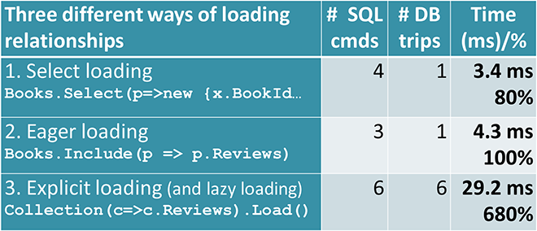

<!-- .slide: data-background="#003d73" -->
## EF Query and Manipulations



 <!-- .element style="width: 200px; position: fixed; bottom: 50px; left: 50px" -->

----

### Agenda

* Query
* Loading strategies
    * Explicit
    * Eager
    * Multiple leves (join)
    * Lazy
    * Select Loading
* Tracing
* Create / Update

---

## Querying

// TODO: arrows to 
// 1 DbContext property accces
// 2 A series of LINQ and/or EF core commands
// 3 An execute command
* Access via DbContext

```csharp
_context.Books.Where(b => 
    b.Title.StartsWith("Database").ToList();
```

vs

```csharp
from b in _context.Books
where b.Title == "Database"
select b;
```

**Note**: Requires Linq and EntityFrameworkCore imports

Note:
1. DbContext property accces

2. A series of LINQ and/or EF core commands

3. An execute command

----

### Execute commands

* .ToList()
* .ToArray()
* .Count()
* ...

----

### Async execution

* Ends with Async()
    * E.g. .ToListAsync()
* Exists in EntityFrameworkCore namespace - remember use import
* Returns a `Task<A>`
* Use async and await
* Can not execute queries in parallel

---

## Loading Strategies - Explicit

```csharp
public class AClass {
  public async Task<IEnumerable<Book>> LoadExplicit() {
    var books = await _context.Books.ToListAsync();
    foreach(var book in books) {
      await _context.Entry(book).Reference(b => b.Author)
                .LoadAsync();
    } 
    return books;
  }
}
```

* \+ Load relationship when needed
* % More database round-trips
* Usage: e.g. when library only returns primary entity
* Data only used in some circumstances, so we only load needed data

----

### Loading Strategies - Eager

```csharp
public class AClass {
  public IEnumerable<Book> LoadEager() {
    var books = _context.Books
      .Include(b => b.Author)
      .Include(b => b.Review)
      .ToList();
    return books;
  } }
```

* \+ Loaded by EF Core efficiently with a minimum of round-trips
* % Load all data, even when not needed
* If relationship does not exists, EF does not fail
* Since 3.0 this uses JOIN extensively - Be AWARE

----

### Loading Strategies - multiple levels

```csharp
public class AClass {
  public IEnumerable<Book> LoadMultipleLevels() {
    var books = _context.Books
      .Include(b => b.Author)
      .Include(b => b.Review)
        .ThenInclude(r => r.Voter)
      .ToList(); 
    return books;
  } }
```

* ThenInclude can be chained

----

### Loading Strategies - Select

```csharp
public class AClass {
  public object LoadSelect() {
    return _context.Books
      .Select(b => new {
        b.Title,
        b.Isbn,
        NumReview = b.Reviews.Count
      });
  } }
```

* \+Load specifically the data needed, including database calculations
* % Have to write each query by hand

**Note**: Includes are ignored when returning instances which are not an entity type

Note:
Use LINQ to create anonymous objects with specific data

----

### Loading Strategies - Lazy (1/2)

1. Install NugetPackage 'Microsoft.EntityFrameworkCore.Proxies'
2. a. Enable proxies in DbContext

```csharp
public class Context : DbContext {
  protected override void OnConfiguring(
                    DbContextOptionsBuilder optionsBuilder)
    => optionsBuilder
        .UseLazyLoadingProxies()
        .UseSqlServer(myConnectionString); 
}
```

2. b. Or by injecting LazyLoader into service

This enables lazy loading of navigational properties that can be overridden. 

----

### Loading Strategies - Lazy (2/2)

3.  Requires that all navigational properties are declared virtual

```csharp
public class Author {
    ...
    public virtual List<Book> Books {get; set;}
}
```


```csharp
public BookServices(ILazyLoader layzyLoader)
```


---

## Tracking

To track

```csharp
_context.Books.ToList()
```

or to NoTrack

```csharp
_context.Books.AsNoTracking().ToList()
```

* Better performance in readonly scenarios

----

### Changing

Without AsNoTracking - data can be changed:

```csharp
var book = _context.Books.Single(p =>
        p.Title == "Database Systems");
book.Isbn = "12341234";
_context.SaveChanges();
```

When SaveChanges is run, EF Core method DetectChanges which compares snapshot with application copy

TODO: Insert example

----

### Create

```csharp
public class AClass {
  public void Create() {
    var book = new Book {
      Isbn = "1234",
      Title = "Functional Programming in Scala",
      Author = paulChiusano
   };
  _context.Add(book); // or _context.Books.Add(book);
  _context.SaveChanges();
  } }
```

* EF Core expects primary key with SQL IDENTITY.
* Primary keys which are eg. GUID should be created with ValueGenerator

----

### Update

```csharp
public class AClass {
  public void Update() {
    var book = _context.Books.Single(p =>
                    p.Title == "Database Systems");
    book.Isbn = "12341234";
    _context.SaveChanges();
  }
}
```

----

### Delete

```csharp
public class AClass {
  public void Delete() {
    var book = _context.Books.First();
    _context.Remove(book); // or _context.Books.Remove(book);
    _context.SaveChanges();
  }
}
```

----

### Manipulating content

* Multiple save/delete/update statements can be made in a single `SaveChanges()`
* `SaveChanges` vs `SaveChangesAsync`

---

## Exercises :)

<!-- .slide: data-background="./img/make-homework-fun.jpg" -->

----

## References