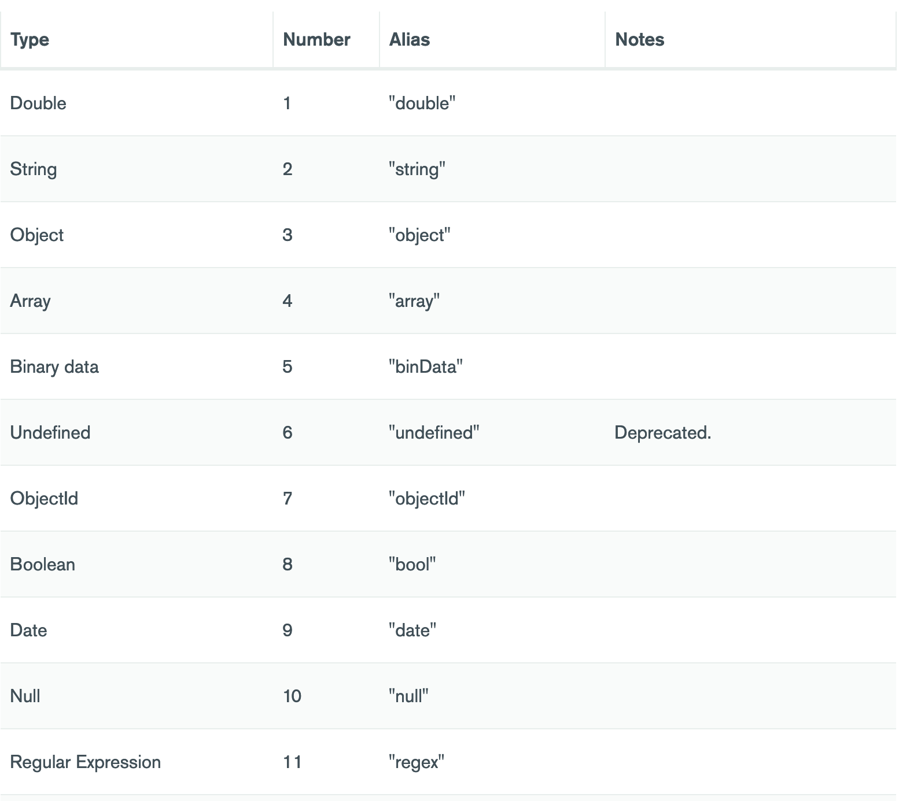

<!-- .slide: data-background="#003d73" -->
## NoSql and Mongo introduction

 <!-- .element style="width: 200px; position: fixed; bottom: 50px; left: 50px" -->

----

## Agenda

* Modeling / Normalization
* Polymorphism
* Working with NoSQL

---

### Document databases

* Breaks 1st normal form:
    * each row contains one value
* Designed to make it easier (and faster) to scale horizontally on different nodes
    * Possible because
        * No JOIN operation
        * Sharding

----

### Document databases

* No longer a single given way of designing a database
* Denormalizing data
    * Embedding all (or most) related data into a **single document** (BSON in MongoDB)
    * Retrieving or writing document(s) in a **single operation**
    * Fewer queries


----

### Mongo DB

* Specific for MongoDB
    * Stores an list of documents
    * BSON types (Binary representation of JSon)
        * Arrays of values, object, null
    * Allows documents to be up to 16 MB

----

### Example data

```javascript
{   "_id": ObjectId("624d83ab9225bfaa18640a1f"),
    "firstName": "Thomas",
    "lastName": "Andersen",
    "addresses": [
        {   "line1": "100 Some Street",
            "line2": "Unit 1",
            "city": "Seattle",
            "state": "WA",
            "zip": 98012
        }
    ],
    "contactDetails": [
        { "email": "thomas@andersen.com" },
        { "phone": "+1 555 555-5555", "extension": 5555 }
    ]
}
```

----

### MongoDB terminology

* Database consists of one or more collections (tables)
* Documents are stored in collections 
* MongoDb document is like a tuple
* Consists of key:value pairs
    * Values can be: other documents, arrays, and simple types

----

#### BSON




----

### Benefits of model

* Similar to types in most programing language
* No expensive joins
* Dynamic schema

----

#### MongoDB Features

* Performance
    * Fewer queries
    * Keys (sub documents)
* Query Language
    * CRUD and Data searches
* Availability
    * Via Replica set
    * Automatic failover
    * Data redundancy
* Scalability
    * Sharding

----

#### Sharding

* Shard - contains a subset of data
* Mongos - query router
* Config servers - Meta data and configurations
* Uses shard key(s) to distribute data. All data must 
contain this key
    * + Distributed Read/Writes
    * + Storage
    * + High availability
    * - Complexity
    * - Infrastructure

----

#### Sharding


---

### Schema design


----

#### Guidelines

* Start with an E/R digram
    * Follow with an actual design
    * Examplify
* Posibilities
    * Embed data
    * Links between data
* Optimize for fewer roundtrips
     * What data belongs together?
     * What data is being used together?
     * What data is being updated together?

----

#### Embedding

* So when to embed?
    * There are a contained relationship
    * There are a one-to-few relationship
    * Embedded data changes infrequently
    * Embedded data will not grow without bound
    * Embedded data is often queried together

----

### Referencing

* No concept of foreign key
    * Link between entities is considered weak links and must be maintained by application(s)
* Reference when
    * One-to-many relationships
    * Many-to-many relationships
    * Related data changes frequently
    * Data can be unbounded

----

### 1-N - Embedded

```javascript
// Books embedded in Publisher
{ "id": "1",
    "name": "O'Reilly",
    "books": [
        {   "name": "Learning python" } 
        {   "name": "Jenkins 2 - up & running" } 
        {   "name": "Head First Kotlin" } 
        ...
        {   "name": "Mastering Ethereum" } 
        ...
    ],
...}
```

note:

Not smart if books changes often or there are many books.

----

### 1-N - Referenced

```javascript
// In publisher collection
{ "id": "1",
    "name": "O'Reilly",
    "books": [1, 2, 3, 12, 15, 19, 25, 26, 27, 49, 50 ...],
    ...}

// In Books collection
{   "id": "1", "name": "Learning python" } 
{   "id": "2", "name": "Jenkins 2 - up & running" } 
{   "id": "3", "name": "Head First Kotlin" } 
...
{   "id": "50", "name": "Mastering Ethereum" } 
...
```

----

### 1-N - Embedded some data

```javascript
// In publisher collection
{ "id": "1", "name": "O'Reilly", }

// In Books collection
{ "id": "1", "name": "Learning python", "publisher_id": 1 } 
{ "id": "2", "name": "Jenkins 2 - up & running", "publisher_id": 1 }  
{ "id": "3", "name": "Head First Kotlin", "publisher_id": 1 } 
...
{ "id": "50", "name": "Mastering Ethereum", "publisher_id": 1 } 
... 
```

----

### N-N - referenced

* Putting joining ids in both collections

```javascript
// Im Author collection
{ "id": "a1", "name": "J.K. Rowling",
         "books": ["b1", "b7", "b8", "b9" ]}
{ "id": "a2", "name": "Amanda Berlin",
         "books": ["b10", "b14" ]}
{ "id": "a3", "name": "Lee Brotherston",
         "books": ["b10", "b11" ]}
```

```javascript
// In Book collection
{ "id": "b1",
     "name": "Harry Potter and the Philosophers Stone",
     "authors": ["a1"] }
{ "id": "b7",
     "name": "Harry Potter and the Goblet of Fire",
     "authors": ["a1"] }
{ "id": "b10",
     "name": "Defensive Security Handbook",
     "authors": ["a3", "a2"] }
```

----

### N-N - Embeding some

* Alternatively merging data together based on application usage
    * e.g. author name with book - since author name don't change to often

```javascript
// In Books collection
{ "id": "b1",
  "name": "Harry Potter and the Philosophers Stone",
  "author_name": "J.K. Rowling",
  "authors": ["a1"] }
// In Author collection
{ "id": "a1", "name": "J.K. Rowling",
         "books": ["b1", "b7", "b8", "b9" ]}
```

----

### Polymorphism

* Can be necessary to mix different documents types in same collection
    * **Problem**: Which document is of which type
    * **A solution**: Wrap them in document with meta information

```javascript
{   "id": "1",
    "name": "O'Reilly",
    "type": "publisher"
},
{   "id": "2",
    "name": "Mark Hamill",
    "type": "actor"
}
```

----

### Why Polymorphism

* Keep them close together
* Performing queries on shared fields on different types
    * Still able to perform queries on specific types
* Avoid `ALTER TABLE` statements while preserving ability to evolve schema
    * can be time consuming (like on RD)

----

### So how to tacke schema changes

* In NoSQL this often done in application
    * Updating/altering entities when read
    * Algorithm:
        1. Read data
        2. If data is of old version
            1. update data
            2. save data

---

### Document DB Drawbacks

* Storage inefficiency
    * No rules for which data is present
    * Small values vs long property names

```javascript
{
    "id": "ert1",
    "some_long_name": 1,
    "another_longer_name", 2.2,
    ...
},
{
    "id": "abc1",
    "val": 1
}
```

----

### Drawbacks cont.

* Difficulties creating usefull indexes
    * can be handled by using array and index this instead of using values

```javascript
{...
    properties : {
    'Seek Time' : '5ms',
    'Rotational Speed' : '15k RPM',
    'Transfer Rate' : '...'
    ... }}
// vs 
{...
properties: [
    ['Seek Time', '5ms' ],
    ['Rotational Speed', '15k RPM'],
    ['Transfer Rate', '...'],
    ... ]}
```

---

### Interacting in MongoDB

* Done using *JavaScript*
* Either from shell or MongoDb Compass
    * or program :)

----

#### Database and Collections

* `use myNewDB`
    * use existing database / creates new
* `db.myNewCollection1.insertOne( { x: 1 } )`
    * creates new collections and inserts element

----

### MongoDB shell

* Whenever we are in the shell `db` references the current selected database
* Inserting into database

```javascript
db.inventory.insertMany([
   { item: "journal", qty: 25, status: "A", size: { h: 14, w: 21, uom: "cm" }, tags: [ "blank", "red" ] },
   { item: "notebook", qty: 50, status: "A", size: { h: 8.5, w: 11, uom: "in" }, tags: [ "red", "blank" ] },
   { item: "paper", qty: 10, status: "D", size: { h: 8.5, w: 11, uom: "in" }, tags: [ "red", "blank", "plain" ] },
   { item: "planner", qty: 0, status: "D", size: { h: 22.85, w: 30, uom: "cm" }, tags: [ "blank", "red" ] },
   { item: "postcard", qty: 45, status: "A", size: { h: 10, w: 15.25, uom: "cm" }, tags: [ "blue" ] }
]);
```

* MongoDB adds an `_id` field with an ObjectId value if the field is not present in the document

----

#### Selection

* `db.inventory.find({}).pretty()` 
    * `.pretty()` is optional
```javascript
db.inventory.find(
    {status: "D"} // or
    // {qty: 0, status: "D"} // or  
    // {tags: "red"} // or
    // {size: { h: 14, w: 21, uom: "cm"}}
)
```
* What to return
```javascript
db.inventory.find( { }, { item: 1, status: 1 } )
```
    * `1`: include, `0`: exclude
    * `_id` is special

note:

`db.inventory.find({})` -> SELECT * FROM inventory

`db.inventory.find({status: "D"})` -> SELECT * FROM inventory WHERE status = "D"

`db.inventory.find( { }, { item: 1, status: 1 } )` - > SELECT _id, item, status FROM inventory

----

#### Sorting etc

```javascript
db.inventory.find({})
    .sort({qty: 1})
    .limit(20)
db.inventory.find({})
    .limit(20)
    .skip(page * 20)
db.inventory.find({"item": /book$/})

// create index
db.inventory.createIndex("tags": 1)
```

----

#### Alternative selection methods

* [db.collection.find()](https://docs.mongodb.com/manual/reference/method/db.collection.find/#db.collection.find)
* [db.collection.findOne()](https://docs.mongodb.com/manual/reference/method/db.collection.findOne/#db.collection.findOne)
* [db.collection.aggregate()](https://docs.mongodb.com/manual/reference/method/db.collection.aggregate/#db.collection.aggregate)
* [db.collection.countDocuments()](https://docs.mongodb.com/manual/reference/method/db.collection.countDocuments/#db.collection.countDocuments)
* [db.collection.estimatedDocumentCount()](https://docs.mongodb.com/manual/reference/method/db.collection.estimatedDocumentCount/#db.collection.estimatedDocumentCount)
* [db.collection.count()](https://docs.mongodb.com/manual/reference/method/db.collection.count/#db.collection.count)
* [db.collection.distinct()](https://docs.mongodb.com/manual/reference/method/db.collection.distinct/#db.collection.distinct)

More at:<!-- .element: style="font-size: 18px" --> [https://docs.mongodb.com/manual/reference/method/js-collection/](https://docs.mongodb.com/manual/reference/method/js-collection/) <!-- .element: style="font-size: 18px" -->


----

#### Identifier `_id`

* All documents in a collection must have an unique `_id`
* If omitted _id is generated - by following rules
    * a 4-byte value representing the seconds since the Unix epoch,
    * a 5-byte random value, and
    * a 3-byte counter, starting with a random value

```javascript
{
    _id: ObjectId("5099803df3f4948bd2f98391"),
    name: { first: "Alan", last: "Turing" },
    ...
    }
```


note: 

```javascript
{
    _id: ObjectId("5099803df3f4948bd2f98391"),
    name: { first: "Alan", last: "Turing" },
    birth: new Date('Jun 23, 1912'),
    death: new Date('Jun 07, 1954'),
    contribs: [ "Turing machine", "Turing test", "Turingery" ],
    views : NumberLong(1250000)}
```

----

#### Views

* Read only views:
    * `excludes` private/confidential data from a collection
    * `adds` computed fields
    * `joins` data from related collections
        * use with care

---

## Exercises :) <!-- .element: style="color: white" -->

<!-- .slide: data-background="./img/exercises.png" data-background-size="contain" -->

<br/>
<br/>
<br/>
<br/>
<br/>
<br/>

----

## References