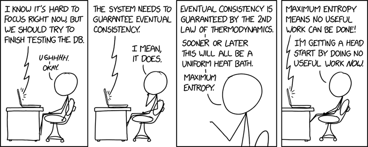
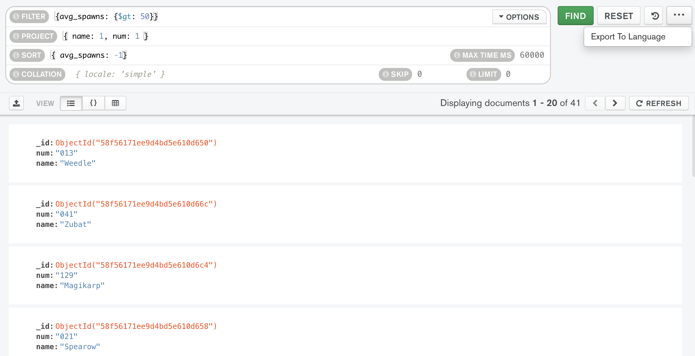

<!-- .slide: data-background="#003d73" -->
## Mongo queries and consitency

 <!-- .element style="width: 200px; position: fixed; bottom: 50px; left: 50px" -->

 <!-- .element: style="height: 200px" -->

----

## Agenda

* Querying
* Consistency
    * Two phase-commit
    * Multiple documents

---

## Querying



----

### Selection


```csharp[4-10|12]

_books = database.GetCollection<Book>(collection);
// ...
var Books = new List<Book>();
using (var cursor = _books.Find(b => true).ToCursor())
{
    while (cursor.MoveNext()) {
        Books.AddRange(cursor.Current);
    }
}
// or
_books.Find(book => true).ToList();
```

----

### Projection

```csharp [3-4|5-6|7]
public IEnumerable<string> GetFormats(string id)
{
    var projection = Builders<Book>.Projection
            .Include(b => b.Formats);
    var bson = _books.Find<Book>(book => book.Id == id)
            .Project(projection).FirstOrDefault();
    var array = bson.GetElement("Formats").Value.AsBsonArray;
    return array.Select(str => str.AsString);
}
```

----

### Aggregation

* Works like a pipeline
* Consists of a set of stages
```csharp
var results = db.GetCollection<ZipEntry>.Aggregate()
    .Group(x => x.State,
           g => new { State = g.Key, TotalPopulation = g.Sum(x => x.Population) } )
    .Match(x => x.TotalPopulation > 20000)
    .ToList();
```
* Stages:
    * Project, Sort, Match, Group, Limit, ...

----


### So how to tacke schema changes

* In NoSQL this often done in application
    * Updating/altering entities when read
    * Algorithm:
        1. Read data
        2. If data is of old version
            1. update data
            2. save data

----

### Update schema


```csharp [1|4-5|6-8|10-18]
[BsonIgnoreExtraElements]
class Model : ISupportInitialize {
    ...
    [BsonExtraElements]
    public IDictionary<string, object> ExtraElements { get; set; }
    public void BeginInit() { }
    
    public void EndInit()
    {
      object oldValue;
      if (!ExtraElements.TryGetValue("OldField", out oldValue))
      {
        return;
      }
    
      var value = (string) oldValue;
      ExtraElements.Remove("OldField");
      // Set new values
    }
}

---

### Why Transactions

* Deletion in 1-N relationship
* Adjusting quantity of inline object
* Keeping consistency

----

### Two-phace commit

In a distributed system (multiple DB Servers)

1. Each server prepares to execute a transaction (locking documents or collections)
1. All servers apply the changes
1. All servers acknowlegde the changes
1. Lock is removed

This is potential a **really slow** operation. So we need something different

----

### Removing in a 1-N relationship

* Three solutions:
    1. `order` then `order_items`
    1. `order_items` then `order`
    1. if `order_items` are embedded - just delete `order`

----

### Problems with Embedding

* Changing `qty` in application memeory can cause race conditions
```javascript
{ _id: '11223',
  total: 500.94, ...
  items: [
    { sku: '123', price: 55.11, qty: 2 },
    { sku: '...', ... },... ] }
```
* Using db.collection.update - here we still need to check if document has changed
```javascript
db.orders.update(
  { '_id': order_id, 'items.sku': sku },
  { '$inc': {
    'total': total_update,
    'items.$.qty': qty } })
```

----

### Consistency between documents

1. Update each document with `db.collection.update()`
    * What if something throws and exception?
1. Emulate transactions in data model
    * Create a transaction collection
        * Document can be in *new*, *committed* or *rollback* state.
        * Clean up accordingly

----

### Modeling transaction

* Algorithm
    1. Insert transaction
    1. Withdraw money
    1. Insert money
    1. Update transaction
* Cleanup (delete and rollback periodically)
```javascript
// Transaction document
{ _id: ObjectId(...),
 state: 'new',
 ts: ISODateTime(...),
 amt: 55.22,
 src: 1,
 dst: 2
}
```

----

## Eventually consistency

* Avoid using transactions altogther
* Accept that all data is not always up to date
    * As long as they will be at some point


----

### CQRS as an example


