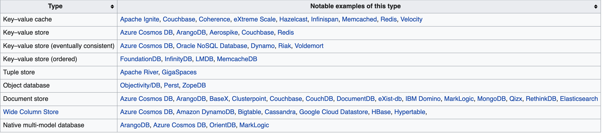

<!-- .slide: data-background="#003d73" -->
## Use cases


 <!-- .element style="width: 200px; position: fixed; bottom: 50px; left: 50px" -->

----

### Agenda

* Document database
  * Schema considerations
  * Performance
  * Handling Category data
  * Sharding 
* Other types

---

### Schema considerations

* Data types
* Nested
* Query

----

#### What to query

* What data should be nested?
  * what you would join in RDB
* Write / update

----

#### Write policy

```javascript
db.inventory.insert(
    { sku: "abcdxyz", qty : 100, category: "Clothing" },
    { writeConcern: { w: 2, j: true, wtimeout: 5000 } }
)
```

* w: number of acknowledgements
* j: should be written on disc
* wtimeout: should always be set when j=true

----

#### Indexes

* Order is important
  * where name = ? and date > ?
  * Index(name, date, cat)
  * Index(date, name, cat)
* use `explain()`

----

#### Bulk insert

```javascript
db.items.initializeUnorderedBulkOp();
bulk.insert( { item: "abc123", defaultQty: 100,
               status: "A", points: 100 } );
bulk.insert( { item: "ijk123", defaultQty: 200,
               status: "A", points: 200 } );
bulk.insert( { item: "mop123", defaultQty: 0,
               status: "P", points: 0 } );
bulk.execute();
```

---

### Performance

* Changing documents
* Indexes
* Multiple servers

----

#### Example 1

Inserting per hour, per min

* -> Data is being moved - over time fragmented

```javascript
{ 
  ...,
  data: [
    1: 345,
    2: 324,
    3: 145
  ]
}
```

----

#### Example 2

Preallocating arrays

```javascript
{ 
  ...,
  data: [
    1: 345,
    2: 324,
    3: 145,
    4: 0,
    5: 0,
    ...
  ]
}
```

* Searching

----

### Example 3

* Preallocation plus searchable

```javascript
{ 
  ...,
  data: [
    0: [1: 12, 2: 134, 3: 12,...],
    1: [1: 0, ...],
    2: [1: 0, ...],
    ...
  ]
}
```

---

### Handling data

* Category hierachy in NoSQL?
  * In RDB?


----

#### RDB

Inheritance in 

* Single table
vs
* Multiple tables

Consider space consumptions? Easy of query

----

#### NoSQL

* Common values vs details

```javascript
{
  name: "...",
  parent: "/a/b/c",
  details: [
    {cat: ".."},
    ...
  ]
}
```

* Easy to see/read
* Easy to query
* Hard to update

----

#### Alternative

* Could put ancesters in embedded array

```javascript
{
  name: "...",
  parent: ["a", "b", "c"]
  details: [
    {cat: ".."},
    ...
  ]
}
```


---

### Sharding

* Sharding key
  * Should distribute data evenly

* % date / time
* \+ region
* \+ composed key

----

#### Collections types

* Capped collection
* TTL collection
* Normal collection
  * move data/change collection

---

## Other types



----

### Simpler

 

----

### NoSQL Design

* Typically designed for availability
* Eventually consistent
* Not only normalized data
  * Also handles semistructured data
* Flexible data
* Move work to application

----

#### ACID vs BaSE

* Some, not all do not support
  * Atomicity
  * Consistency
  * Isolation
  * Durability
* Instead often
  * Basic Availability
  * Soft State
  * Eventually Consistency

----

### Key/Value stores

Examples: Redis, Memcached, Riak

* Typically hash-table (or dictionary)
  * Key Value pairs
*  Values
  * Simple types
  * Maybe complex objects like Json
* Read data
  * Only by key
* Used for cache, message queues, session management

----

#### Redis example

```csharp
using System;
using ServiceStack.Redis; 
namespace Redis {
 class Program {
   static void Main(string[] args) {
     Console.WriteLine("Hello World!");

     var manager = new RedisManagerPool("localhost:6379");
     using (var client = manager.GetClient()) {
       client.Set("foo", "bar");
       Console.Read();
       Console.WriteLine("foo={0}", client.Get<string>("foo"));
     }
     Console.Read();
}}}
```

----

#### Document database

Examples: MongoDb, Couchbase, CouchDb

* Key / Value store
  * Grouped in collections
* Values contains metadata
  * Used for Index
  * Search
  * Etc
* Often comes with query language
* Documents can be embedded
* Sharding

----

### Column oriented DBMS

Examples: BigTable, HBase, and Cassandra

|RowId   |EmpId   |Lastname   |Firstname   |Salary   |
|--------|--------|-----------|-------|----|
|001|10|Smith|Joe|60000|
|002|12|Jones|Mary|80000|
|003|11|Johnson|Cathy|94000|
|004|22|Jones|Bob|55000|

----

```
10:001,12:002,11:003,22:004;
Smith:001,Jones:002,Johnson:003,Jones:004;
Joe:001,Mary:002,Cathy:003,Bob:004;
60000:001,80000:002,94000:003,55000:004;
```

----

### Column based DBMS

* Stores each column in file or region
* Query only needed data
  * Fewer seeks on disc
  * Less read data
* Data can be compressed per column, better compression
* Load _can_ be slower because of compression
* Write is typically slower since data is spread across multiple files/regions

----

### Used in

* Heavy on reads
  * Analytics
  * Cases that performs aggregates
* Duplication of data


----

### Graph based database

Examples: Neo4j, ArangeDB, OrientDB

* Schemaless
* Highlighting relations between data
* Vocabulary
  * Entity -> Node
  * Property
  * Edge -> Relationsship
    * Directional
    * Undirection
* Make some operations much simpler

----


---

## References

* NoSql Type https://en.wikipedia.org/wiki/NoSQL
* https://www.researchgate.net/publication/267039442_A_linear_algebra_approach_to_OLAP