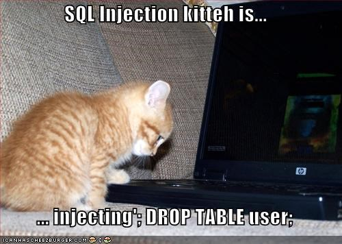

<!-- .slide: data-background="#003d73" -->
## Security

 <!-- element: style="float:right" -->

 <!-- .element style="width: 200px; position: fixed; bottom: 50px; left: 50px" -->

----

## SQL Injections


----

### Which is

* The ability to run potential malicious SQL code on database server
  * Done by injecting SQL code into input

```csharp
SqlConnection conn = new SqlConnection(@"Data Source=...;");  
SqlCommand cmd = new SqlCommand("Select * from GridViewDynamicData " +
      " where Field1= '" + Text +"'", conn);  
conn.Open();  
SqlDataAdapter ad = new SqlDataAdapter(cmd);  
// do stuff with adapter  
conn.Close();
```
* Given Text equaling `"'; DROP TABLE users; '"`


----

### Another example

* Handle Login
```csharp
SqlConnection conn = new SqlConnection(@"Data Source=...;");  
SqlCommand cmd = new SqlCommand("Select * from SYSUser " + 
      " where LoginName= '" + TextUser +
      "' and PasswordEncryptedText='" + TextPass + "'", conn);  
conn.Open();  
SqlDataAdapter ad = new SqlDataAdapter(cmd);  
// Do stuff with adapter
conn.Close(); 
```
* Given `TextUser = "' or 'hacked' = 'hacked'"`
* Given `TextPass = "' or 'hacked' = 'hacked'"`

----

How to solve SQL injections

* Escape input values
```csharp
SqlConnection conn = new SqlConnection(@"Data Source=...;");  
SqlCommand cmd =
   new SqlCommand("Select * from GridViewDynamicData " +
    "where Field1= @Text", conn);
cmd.Parameters.AddWithValue("@Text",Text);  
conn.Open();
cmd.Dispose()
SqlDataAdapter ad = new SqlDataAdapter(cmd);  
// do stuff with adapter  
conn.Close();
```
* Use built in mechanisms

----

### ORM Systems

* Entity Framework (Core)
  * using FromSql() allows potential users to make SQL injections
    * string interpolation works like parameters

----

### FromSQL in Ef-Core 

* Be aware of `ToSql` overloads
  * in <=2.0 `FromSQL()`

```csharp
var str = "user";
// Method 1
context.Users.FromSqlRaw($@"SELECT * FROM Users WHERE name ='"+ str + "'");   // ok
// Method 2
context.Users.FromSqlRaw($@"SELECT * FROM Users WHERE name = {str}");         // ok
// Method 3
context.Users.FromSqlRaw($@"SELECT * FROM Users WHERE name = {str}").ToSql(); // ok
// Method 4
var sql = $"SELECT * FROM Users WHERE name = {str}"
context.Users.FromSql(sql).ToSql(); // not ok

```

---

## Database protection

SQL Server

* Use `ALTER ROLE` to add/remove members from groups
  * Db_owner, db_securityadmin, db ...
  * `ALTER ROLE db_datareader ADD MEMBER Ben;`
  * [Database level roles](https://docs.microsoft.com/en-us/sql/relational-databases/security/authentication-access/database-level-roles?view=sql-server-ver15)

----

### On other DBMS'

MySQL/MariaDb/ProtgreSQL

* `GRANT ALL ON example_database TO 'example_user'@'%';`
  * Can create specific roles for read/write/update etc per table

----

### Hide sensitive data

SQL Server
* Masked with
  * `varchar(12) MASKED WITH (FUNCTION = 'default()') NULL`
* Other built in functions: `default()`, `email()`, `random()`, `partial()`

----

### On other DBMS'

* MySQL/MariaDB
  * `masked_pan()`, `masked_pan_relaxex()`, `mask_ssn()`, ...


* Hide columns
  * `ALTER TABLE [dbo].[Account] ALTER COLUMN [EndDate] ADD HIDDEN;`

---

## NoSQL injections (javascript)

* Keywords
```javascript
true, $where: '1 == 1'
, $where: '1 == 1'
$where: '1 == 1'
', $where: '1 == 1
1, $where: '1 == 1'
{ $ne: 1 }
', $or: [ {}, { 'a':'a
' } ], $comment:'successful MongoDB injection'
db.injection.insert({success:1});
db.injection.insert({success:1});return 1;db.stores.mapReduce(function() { { emit(1,1
|| 1==1
' && this.password.match(/.*/)//+%00
' && this.passwordzz.match(/.*/)//+%00
'%20%26%26%20this.password.match(/.*/)//+%00
'%20%26%26%20this.passwordzz.match(/.*/)//+%00
{$gt: ''}
[$ne]=1
';sleep(5000);
';it=new%20Date();do{pt=new%20Date();}while(pt-it<5000);
```

----

### MongoDB Selection

* Also possible to create injections attack on MongoDb

```javascript
db.myCollection.find(
  { active: true,
    $where: function() { return obj.credits -      
       obj.debits < $userInput; }
  } 
);
```

---

## References

* [Meme](https://cheezburger.com/813801728)
* [MongoDb inject workd list](https://github.com/cr0hn/nosqlinjection_wordlists/blob/master/mongodb_nosqli.txt "")

